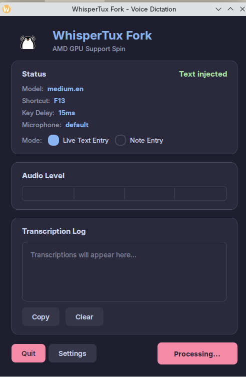

# Wayland Voice Typer



A voice dictation application for Linux, specifically designed for Wayland desktop environments. This is a fork of [WhisperTux](https://github.com/cjams/whispertux) modified to support AMD GPU acceleration via Vulkan.

## Features

- **Native Wayland Support**: Built with PySide6 for seamless Wayland/KDE Plasma integration
- **AMD GPU Acceleration**: Vulkan backend for whisper.cpp on AMD GPUs
- **Custom Model Support**: Use standard Whisper models or your own GGML finetunes
- **Flexible Model Discovery**: Scans multiple directories for models
- **Audio Feedback**: Configurable beeps to indicate recording state
- **Two Operation Modes**: Live text injection or note collection

## Tech Stack

- **GUI Framework**: PySide6 (Qt for Python) - native Wayland support, KDE integration
- **Audio**: sounddevice + PipeWire/PulseAudio
- **Transcription**: whisper.cpp with Vulkan GPU acceleration
- **Text Injection**: ydotool (Wayland-compatible)
- **Global Shortcuts**: evdev for hardware-level keyboard capture

### Why PySide6?

This fork uses PySide6 instead of the original CustomTkinter for several reasons:
- Better Wayland compatibility (Tk has known issues with grab_set, window positioning)
- Native KDE Plasma integration
- Superior font rendering
- More reliable dialog handling

## Fork Modifications

### GPU Acceleration
- Configured to use an external Vulkan-accelerated `whisper-cli` binary
- Set `whisper_binary` in config to point to your Vulkan-built whisper.cpp
- Works with AMD GPUs (tested on RX 7700 XT) via Mesa RADV driver

### Model Support
- **Custom model directories**: Scans `~/ai/models/stt/` for models
- **Finetune discovery**: Finds GGML finetunes in `~/ai/models/stt/finetunes/`
- **Flexible naming**: Supports both `ggml-model.bin` and custom naming

### Other Changes
- Default keybinding changed to F13 (useful for macro keys)
- Reorganized directory structure (`app/` folder)
- Debian packaging support
- Two operation modes: Live Text Entry and Note Entry

## Installation

### Prerequisites

1. **Vulkan-enabled whisper.cpp** - Build whisper.cpp with Vulkan support:
   ```bash
   git clone https://github.com/ggerganov/whisper.cpp
   cd whisper.cpp
   mkdir build && cd build
   cmake .. -DGGML_VULKAN=ON
   make -j$(nproc)
   ```

2. **ydotool** - For text injection:
   ```bash
   sudo apt install ydotool
   systemctl --user enable --now ydotool
   ```

3. **System Dependencies**:
   ```bash
   sudo apt install python3-pyside6 portaudio19-dev
   ```

### From Debian Package

```bash
./build-deb.sh
sudo dpkg -i whispertux_1.0.0_all.deb
```

The first run will automatically create a virtual environment and install Python dependencies.

### From Source

```bash
cd app
python3 -m venv .venv
source .venv/bin/activate
pip install -r requirements.txt
python main.py
```

Or using uv:
```bash
cd app
uv venv .venv
uv pip install -r requirements.txt
source .venv/bin/activate
python main.py
```

## Dependencies

### Python Packages (requirements.txt)
- `PySide6>=6.5.0` - Qt GUI framework
- `sounddevice>=0.4.6` - Audio capture
- `numpy>=1.24.0` - Audio processing
- `scipy>=1.10.0` - Signal processing
- `evdev>=1.6.0` - Global keyboard shortcuts
- `pyperclip>=1.8.2` - Clipboard access
- `psutil>=5.9.0` - System utilities
- `rich>=13.0.0` - CLI formatting

## Configuration

Config file: `~/.config/whispertux/config.json`

Key settings:
```json
{
  "whisper_binary": "/path/to/vulkan/whisper-cli",
  "model": "large-v3",
  "primary_shortcut": "F13",
  "key_delay": 15,
  "model_directories": [
    "/home/user/ai/models/stt/whisper-cpp",
    "/home/user/ai/models/stt/finetunes"
  ],
  "operation_mode": "live_text_entry"
}
```

## Model Directories

The app scans these locations for models:
- `~/ai/models/stt/whisper-cpp/` - Standard whisper models
- `~/ai/models/stt/finetunes/` - GGML format finetunes
- Custom directories added via Settings

## Usage

1. Launch Wayland Voice Typer from your application menu or run `./run.sh`
2. Press F13 (or configured shortcut) to start recording
3. Speak, then press again to stop
4. Transcribed text is typed into the focused application (Live mode) or added to notes (Note mode)

### Audio Feedback

The app provides audio feedback beeps to indicate recording state (can be disabled in Settings):

| Event | Frequency | Duration |
|-------|-----------|----------|
| Start recording | 1000 Hz | 100ms |
| Stop recording | 600 Hz | 150ms |

Both tones use a sine wave with ~11ms fade in/out to prevent clicks, at 25% amplitude.

### Operation Modes

- **Live Text Entry**: Transcribed text is immediately typed into the currently focused application
- **Note Entry**: Transcriptions are collected in the app's text area for later use

## Troubleshooting

### Audio Issues
- Check PipeWire/PulseAudio is running: `pactl info`
- List available microphones: `pactl list sources short`
- Select specific mic in Settings if default doesn't work

### Keyboard Shortcuts Not Working
- App needs access to `/dev/input/` devices
- May need to run with appropriate permissions or add user to `input` group

### Text Injection Issues
- Ensure ydotool daemon is running: `systemctl --user status ydotool`
- Check ydotool permissions

## Original Project

- **Repository**: https://github.com/cjams/whispertux
- **Original docs**: [app/docs/](app/docs/)

## License

MIT License (see [LICENSE](LICENSE))
